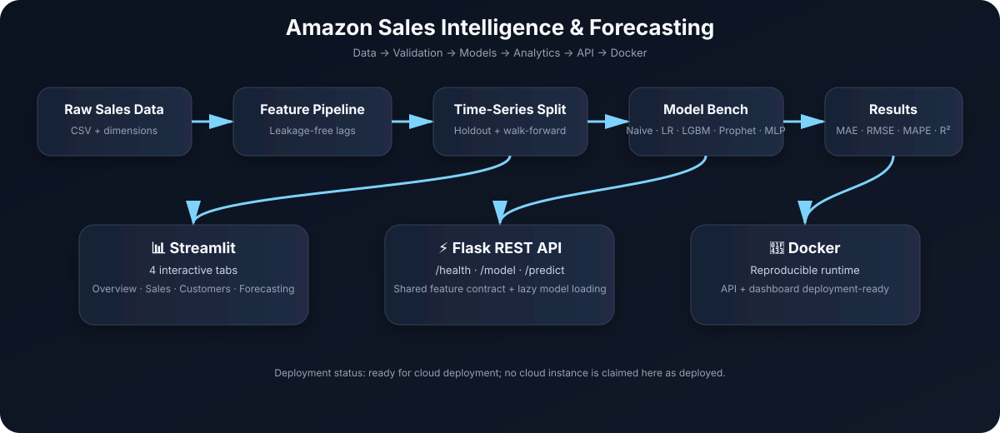

# Amazon Sales Intelligence & Forecasting


End-to-end sales intelligence and demand-forecasting platform built on ~3 years of
Amazon food-category sales data: **leakage-free feature engineering,
chronological evaluation with walk-forward validation, classical + gradient
boosting + Prophet + PyTorch models, an interactive Streamlit dashboard, a
Flask REST API serving the trained checkpoint, and a Docker image that runs
both.**

> **Status: DEPLOYMENT READY — NOT DEPLOYED.**
> The application, tests, dashboard, REST API, and Docker workflow have been verified locally. No cloud deployment is claimed; see [Deployment](#15-deployment) for the runbooks.

---



> **Project snapshot:** 64 automated tests • 5 forecasting models • 4-tab Streamlit dashboard • Flask REST API • Dockerized runtime

---

## Table of contents

1. [Project overview](#1-project-overview)
2. [Problem statement](#2-problem-statement)
3. [Architecture](#3-architecture)
4. [Dataset](#4-dataset)
5. [Preprocessing & feature engineering](#5-preprocessing--feature-engineering)
6. [Leakage prevention](#6-leakage-prevention)
7. [Forecasting methodology](#7-forecasting-methodology)
8. [Models](#8-models)
9. [Actual model comparison](#9-actual-model-comparison)
10. [Evaluation metrics](#10-evaluation-metrics)
11. [Customer segmentation](#11-customer-segmentation)
12. [Streamlit dashboard](#12-streamlit-dashboard)
13. [Flask REST API](#13-flask-rest-api)
14. [Docker](#14-docker)
15. [Deployment](#15-deployment)
16. [Project structure](#16-project-structure)
17. [Local setup](#17-local-setup)
18. [Testing](#18-testing)
19. [Limitations](#19-limitations)
20. [Future improvements](#20-future-improvements)
21. [Original artifacts](#21-original-artifacts)

---

## 1. Project overview

A portfolio-grade forecasting pipeline that takes raw invoice-line sales data
and ships:

- a **validated ML pipeline** (temporal split, walk-forward CV, no leakage),
- **5 models** benchmarked against naive baselines on a genuine holdout,
- a **Streamlit dashboard** (4 tabs: overview, sales, customers, forecast),
- a **Flask REST API** serving the PyTorch checkpoint,
- **one Docker image** running either process,
- **64 automated tests** guarding features, splits, metrics, dashboard, API.

Everything is reproducible from the repository: `pip install -r
requirements.txt` + the two scripts in `scripts/` regenerate every number in
`results/`.

## 2. Problem statement

Retail demand is seasonal, lumpy, and noisy. The business questions:

1. **Forecasting** — given each product's sales history, predict next
   months' product-level sales well enough to beat a naive baseline on
   unseen future months.
2. **Analytics** — what drives revenue: seasonality, product classes,
   discounts, sales reps? Which customers are at risk of churning?
3. **Delivery** — expose results as an interactive dashboard *and* a
   machine-readable API, deployable anywhere Docker runs.

The hard part is not fitting a model — it's evaluating it honestly:
random splits leak the future, rolling features can include the target, and
early stopping on the test set inflates every metric. This project fixes
all three (see [Leakage prevention](#6-leakage-prevention)).

## 3. Architecture

```
data/*.csv  (raw sales facts + dimension tables + KMeans segments)
   │
   ├── src/data.py ──────── load & aggregate → monthly product panel (8,137 rows)
   │        │
   │   src/features.py ──── leakage-free lags & rollings (t-3..t-1 only)
   │        │
   │   src/split.py ─────── chronological split + walk-forward TimeSeriesSplit
   │        │
   │   ├── src/models.py ────── Linear Regression, LightGBM (+ naive baselines)
   │   ├── src/forecasting.py ─ Prophet on aggregate revenue
   │   └── src/torch_model.py ─ PyTorch MLP (train-only scaling, early stop)
   │
   └── scripts/run_training.py ──────► results/model_metrics.json
       scripts/run_torch_training.py ► results/pytorch_metrics.json
                                       results/*holdout_predictions.csv
                                       models/pytorch_model.pt
                                       │
                 ┌─────────────────────┴──────────────────────┐
                 ▼                                            ▼
        Streamlit dashboard (app.py)                Flask API (api/app.py)
        reads data/ + results/                      serves models/pytorch_model.pt
                 └────────────── Docker image (one image, two processes) ──────┘
```

## 4. Dataset

`data/Amazon_foodcategory_sales.csv` — **65,280 invoice lines × 20 columns**,
2017-01-01 → 2019-12-31 (**27 observed months**, including a 9-month data
gap: 2018-04 → 2018-12 has no rows).

| Fact | Value |
|---|---|
| Total revenue | $186,186,297.14 |
| Distinct invoices | 24,679 |
| Distinct customers (`Custkey`) | 615 |
| Distinct products (`Item`) | 657 |
| Sales reps | 64 |
| Units sold | 2,943,190 |
| Strongest month | 2017-09 — $8,786,342.38 |
| Weakest month | 2019-01 — $3,187,480.58 |

Key columns: `Invoice Date`, `Invoice Number`, `Custkey`, `Item`,
`Item Class`, `Sales Amount` (target), `Sales Quantity`, `Sales Price`,
`List Price`, `Discount Amount`, `Sales Margin Amount`, `Sales Rep`.

Data-quality facts (verified by the pipeline):

- `Item Class` is missing on **12.7%** of rows (surfaced as `(missing)` in
  the dashboard, never silently dropped);
- class `P01` dominates: **87% of rows** (56,965/65,280);
- `Sales Price` vs `List Price` correlation ≈ **−0.01** — no linear
  relationship;
- average quarter: **Q4 is −14.9%** vs the mean of Q1–Q3 (Q1 is strongest),
  contradicting the "holiday quarter surge" folklore for this dataset.

Companion tables (normalized during preprocessing, contact fields
synthesized with Faker):

| File | Rows | Content |
|---|---|---|
| `data/customers.csv` | 615 | customer dimension |
| `data/products.csv` | 1,585 | product dimension |
| `data/orders.csv` | 24,739 | order header dimension |
| `data/sales.csv` | 65,280 | normalized fact table |
| `data/customer_segments.csv` | 615 | per-customer RFM metrics + KMeans `cluster` |

## 5. Preprocessing & feature engineering

Per product-month panel (8,137 rows → 6,733 modeling rows after lag dropna):

| Feature | Definition |
|---|---|
| `year`, `month_num`, `quarter` | calendar parts of the forecast month |
| `avg_price`, `list_price` | same-month average selling / list price |
| `sales_lag_1/2/3` | target value at t−1, t−2, t−3 (**previous observed months**) |
| `sales_rolling_3` | mean of the **three previous** observations (t−3..t−1) |

Because of the data gap, "previous" means *previous observed* month — after
the 9-month gap, lags reference the last month that actually exists.

## 6. Leakage prevention

The original notebook's `sales_rolling_3` was `rolling(3).mean()` **centered
on the current row** (t−2..t), which includes the target itself — Linear
Regression could reconstruct the target as `3×rolling − lag₁ − lag₂` and
posted a training R² of 1.000.

Fixed and regression-tested:

```python
df["sales_rolling_3"] = (
    df.groupby(PRODUCT_COLUMN)[TARGET_COLUMN]
      .transform(lambda s: s.shift(1).rolling(3).mean())   # t-3 .. t-1 only
)
```

`tests/test_features.py` **proves** it: perturbing any row's target must
leave that row's (and all future rows') features unchanged. Also enforced:

- **chronological split** — no `train_test_split(shuffle=True)` anywhere;
- **early stopping never sees the test set** — LightGBM stops on
  2019-05..07 (training tail), PyTorch on the identical tail;
- **scalers fit on training rows only** (tested: train stats ≠ full-data
  stats);
- walk-forward CV folds are expanding windows over training months only.

## 7. Forecasting methodology

- **Task A — panel:** forecast each product's `sales_amount` for the next
  month (657 products × months; modeling frame 6,733 rows).
- **Task B — aggregate:** forecast total monthly revenue (Prophet).
- **Split:** chronological on observed months — **train 2017-04→2019-07
  (19 months, 5,173 rows) / test 2019-08→2019-12 (5 months, 1,560 rows)**,
  test fraction 0.2. The first 3 months are dropped (no lag history yet).
- **Validation:** 3 expanding-window `TimeSeriesSplit` walk-forward folds
  over the training months for model comparison; the final 5 months are an
  untouched holdout used exactly once per model.
- **Baselines:** per-product last-observed value (with fallback for the 25
  products lacking history) and an aggregate last-value baseline.

## 8. Models

| Model | Where | Notes |
|---|---|---|
| Naive (last value) | `src/baselines.py` | floor every model must beat |
| Linear Regression | `src/models.py` | interpretable linear baseline |
| LightGBM | `src/models.py` | gradient boosting, 300 rounds in CV, early stop (best_iteration **30**) on training tail |
| Prophet | `src/forecasting.py` | aggregate monthly revenue, yearly seasonality |
| **PyTorch MLP** | `src/torch_model.py` | (64, 32) ReLU → linear, Adam (lr 1e-3, wd 1e-5), MSE, seeded (42), train-only standardization, early stop after epoch 43/83 |

## 9. Actual model comparison

*All numbers are read from `results/model_metrics.json` and
`results/pytorch_metrics.json` — no hardcoded metrics anywhere in code or
docs. Regenerate with `scripts/`.*

### Holdout — product-month sales, 2019-08 → 2019-12 (1,560 rows)

| Model | MAE | RMSE | MAPE | R² |
|---|---:|---:|---:|---:|
| Naive (last value) | 7,483.01 | 21,502.96 | 210.60% | 0.6002 |
| Linear Regression | 6,960.22 | 18,080.50 | 354.55% | 0.7173 |
| **LightGBM** | **6,040.86** | **17,944.85** | 217.92% | **0.7216** |
| PyTorch (MLP) | 11,010.73 | 19,121.98 | 969.92% | 0.6838 |

### Walk-forward CV — 3 expanding folds over training months (MAE, mean ± std)

| Model | MAE | RMSE | MAPE |
|---|---:|---:|---:|
| Naive | 7,160.66 ± 288.92 | 22,361.37 ± 2,059.95 | 303.89% |
| Linear Regression | 7,167.59 ± 308.62 | 18,317.29 ± 2,195.19 | 380.57% |
| **LightGBM** | **6,767.51 ± 525.57** | 18,956.79 ± 2,742.28 | 222.12% |

### Holdout — total monthly revenue, same 5 months

| Model | MAE | RMSE | MAPE | R² |
|---|---:|---:|---:|---:|
| Naive (last value) | **375,756.86** | **446,115.88** | **5.28%** | −0.0325 |
| Prophet | 1,406,797.39 | 2,140,983.82 | 20.00% | −22.7811 |

Prophet's per-month forecast (actual vs predicted): 2019-08 6.84M → 7.38M,
2019-09 7.68M → 7.38M, 2019-10 6.46M → 4.96M, 2019-11 6.64M → 6.84M,
**2019-12 7.25M → 11.75M** (Dec over-forecast dominates the error).

### Honest conclusions

1. **LightGBM is the strongest model** on the panel task: lowest MAE/RMSE,
   highest R², and it wins on both CV and the untouched holdout.
2. **PyTorch does NOT outperform the baselines.** Its holdout MAE
   (11,010.73) is ~82% higher than LightGBM's and worse than even the naive
   baseline; RMSE/R² land between linear regression and naive. This small,
   strongly seasonal panel favors tree ensembles — reported as-is, no
   claimed improvement.
3. **Prophet does NOT beat the naive baseline** on aggregate revenue
   (MAE 1.41M vs 0.38M); the naive baseline is the honest winner there.
4. CV and holdout agree on the ranking (LightGBM < LR ≈ naive on MAE),
   which is what an honest protocol should produce.

## 10. Evaluation metrics

- **MAE** (USD) — average absolute error; primary metric, robust to spikes.
- **RMSE** (USD) — penalizes large misses; always ≥ MAE.
- **MAPE** (%) — included because the target is strictly positive
  (minimum observed monthly product sales ≈ $200). **Caveat:** on
  product-month rows the denominators are small, so MAPE inflates to
  200–970%; treat MAE/RMSE as the meaningful panel metrics (5.28% MAPE on
  aggregate revenue is the interpretable one).
- **R²** — variance explained vs the test-set mean.

Metrics are computed only on rows never used for fitting; the JSON files
record the exact split, folds, and early-stopping provenance.

## 11. Customer segmentation

KMeans (k=4, elbow + silhouette analysis in the notebook) over 5 behavioral
features, persisted to `data/customer_segments.csv` (615 customers with
`days_since_last_purchase`, `order_frequency`, `total_spent`, `cluster`).
The dashboard shows cluster sizes, RFM scatter views, per-cluster metrics —
including that **57.6% of customers (354/615) are >90 days past their last
purchase**. The companion SQL file contains the independent RFM/cohort/CLV
analysis in BigQuery dialect.

## 12. Streamlit dashboard

```bash
streamlit run app.py        # http://localhost:8501
```

| Tab | Contents | Data source |
|---|---|---|
| 🏢 Executive Overview | total revenue, order/customer/product/unit counts, monthly trend | `data/Amazon_foodcategory_sales.csv` |
| 📈 Sales Analysis | monthly revenue, product-class & top-product performance, seasonality | same |
| 👥 Customer Analysis | cluster sizes, RFM scatters, per-cluster metrics, top customers | `data/customer_segments.csv` |
| 🔮 Forecasting | actual vs predicted, model comparison (**MAE/RMSE/MAPE/R² read from `results/*.json`**), CV folds, Prophet forecast | `results/` |

Sidebar filters (date range, item class, product, customer cluster) apply
across tabs. Missing results files degrade to an actionable message
("run `scripts/run_training.py`") instead of crashing. The forecasting tab
contains **zero hardcoded metrics** — a test recomputes MAE from the
predictions CSV and asserts it matches the JSON.

## 13. Flask REST API

Serves the trained PyTorch checkpoint with the **same feature contract** as
training (validated against `src.config.FEATURE_COLUMNS`).

| Endpoint | Method | Returns |
|---|---|---|
| `/health` | GET | `status`, `model_loaded`, `checkpoint_exists` (never requires the model) |
| `/model` | GET | architecture, feature list, split, and **actual** holdout metrics loaded from `results/pytorch_metrics.json` |
| `/predict` | POST | JSON prediction; **400** with per-field `details` on invalid input, **415** for non-JSON, **503** if the checkpoint is missing |

Design: `api/schemas.py` (dependency-free validation), `api/model_service.py`
(thread-safe lazy loading — loads the checkpoint once, on first use),
`api/app.py` (app factory + routes). Preprocessing logic is **not
duplicated** — features come from the shared `src/` contract.

### Example

```bash
curl -s -X POST http://localhost:5001/predict \
  -H 'Content-Type: application/json' \
  -d '{"features": {"year": 2019, "month_num": 9, "quarter": 3,
        "avg_price": 380.55, "list_price": 400.0,
        "sales_lag_1": 15234.11, "sales_lag_2": 14980.44,
        "sales_lag_3": 16001.90, "sales_rolling_3": 15405.48}}'
```

```json
{
  "prediction": 23796.71,
  "target": "product-month sales_amount (USD)",
  "model": "pytorch_mlp",
  "checkpoint": "models/pytorch_model.pt",
  "features_used": { "avg_price": 380.55, "list_price": 400.0, "month_num": 9.0,
                     "quarter": 3.0, "sales_lag_1": 15234.11, "sales_lag_2": 14980.44,
                     "sales_lag_3": 16001.9, "sales_rolling_3": 15405.48, "year": 2019.0 }
}
```

Error example (missing features → 400):

```json
{"error": {"code": "validation_error",
           "details": ["missing features: avg_price, list_price, ..."]}}
```

Run: `python api/app.py` (dev, port 5001) or
`gunicorn --bind 0.0.0.0:5001 -w 1 api.app:app` (production-style).

## 14. Docker

One image, two processes. **Verified locally:** build succeeds, API smoke
test (`/health`, `/model`, `/predict`) and dashboard startup all pass inside
containers.

```bash
docker build -t amazon-sales-forecasting .        # ≈2.3 GB (arm64)

# API only
docker run --rm -p 5001:5001 amazon-sales-forecasting

# Dashboard only
docker run --rm -p 8501:8501 amazon-sales-forecasting \
  streamlit run app.py --server.address 0.0.0.0 --server.headless true

# Or both:
docker compose up -d
```

- CPU-only PyTorch wheels are used in the image (no CUDA bloat);
- `libgomp` is installed for LightGBM;
- **no secrets are baked into the image** — the project needs no credentials;
- `.dockerignore` excludes `.git`, `.venv`, caches, `.env*`, keys, and
  notebooks.

## 15. Deployment

> **Status: DEPLOYMENT READY — NOT DEPLOYED.** No AWS (or other) instance
> has been launched from this repository, and it contains no credentials.

Runbooks in [`deployment/`](deployment/):

| Doc | Contents |
|---|---|
| [`AWS_EC2.md`](deployment/AWS_EC2.md) | EC2 launch, Docker install, clone, build, start API/dashboard, verify, stop, cost notes |
| [`environment.md`](deployment/environment.md) | local setup, env vars (`PORT`, macOS OpenMP), ports, artifact map |
| [`security.md`](deployment/security.md) | secrets policy, firewall/security groups, API input handling, hardening checklist |

Quick verify (once deployed): `curl http://<host>:5001/health` →
`{"status": "ok", ...}` and open `http://<host>:8501`.

## 16. Project structure

```
amazon-sales-forecasting/
├── api/                      # Flask REST API (app, model_service, schemas)
├── dashboard/                # Streamlit tabs (overview/sales/customers/forecasting)
├── data/                     # all CSV datasets
├── deployment/               # AWS EC2 / environment / security runbooks
├── models/                   # trained checkpoints (pytorch_model.pt)
├── results/                  # metrics JSON + holdout prediction CSVs
├── scripts/                  # run_training.py, run_torch_training.py
├── src/                      # config, data, features, split, metrics, models, torch
├── tests/                    # 64 pytest tests
├── app.py                    # Streamlit entry point
├── Dockerfile / .dockerignore / docker-compose.yml
├── requirements.txt / .gitignore
├── README.md / LICENSE
├── Amazon_Sales_Forecasting.ipynb   # original notebook (untouched)
└── Amazon-sales.sql                 # original BigQuery analysis script (untouched)
```

## 17. Local setup

```bash
git clone <repo-url> && cd <repo>
python -m venv .venv && source .venv/bin/activate
pip install -r requirements.txt

# regenerate all results (written into results/ and models/):
python scripts/run_training.py         # Phase-1 metrics  *
python scripts/run_torch_training.py   # Phase-3 checkpoint + metrics

python -m pytest tests/ -q             # tests
streamlit run app.py                   # dashboard → :8501
python api/app.py                      # API → :5001
```

\* On macOS, LightGBM needs an OpenMP runtime (`brew install libomp`, or
point `DYLD_LIBRARY_PATH` at an existing `libomp.dylib` — details in
[`deployment/environment.md`](deployment/environment.md)). Linux/Docker
already have `libgomp`. No other configuration, accounts, or secrets are
required — everything runs on CPU.

## 18. Testing

```bash
python -m pytest tests/ -q      # 64 passed
```

| Area | What is guarded |
|---|---|
| `test_features.py` | **leakage regression**: perturbing a target value must not change any feature; rolling window excludes current row |
| `test_split.py` | train months strictly precede test months; row preservation; gap handling |
| `test_metrics.py` | MAE/RMSE/MAPE/R² on known values; MAPE guard; baseline behavior |
| `test_data.py` | aggregation consistency, date parsing, panel contracts |
| `test_torch_model.py` | prediction shape, save/load round-trip, **train-only scaler**, seed reproducibility, metrics vs recomputed MAE, same-test-period check |
| `test_dashboard.py` | headless `AppTest` boots all 4 tabs; results-file contracts |
| `test_api.py` | `/health`, `/model`, successful prediction (matches a direct model call), 400/404/415/503 error paths, schema edge cases |

## 19. Limitations

- **Small, gappy history:** 27 observed months with a 9-month gap and a
  5-month holdout — conclusions are directional, not production-grade.
- **PyTorch underperforms** every baseline on this panel (see results); the
  architecture is kept as an honest, tested benchmark, not a flagship.
- **Prophet underperforms** the naive baseline on aggregate revenue.
- **Panel MAPE is huge (210–970%)** because of small per-product
  denominators; MAE/RMSE are the meaningful panel metrics.
- `avg_price`/`list_price` are same-month features — valid only if the
  price is known in advance at prediction time.
- Data quirks: 12.7% missing `Item Class`, one class covers 87% of rows,
  customer contact fields are Faker-synthesized (no PII).
- Services are **unauthenticated**; fine behind a private security group,
  not for open internet without a reverse proxy + auth.
- The original notebook's embedded outputs predate the leakage fix and are
  superseded by `results/` (the notebook is deliberately left untouched as
  the historical artifact).

## 20. Future improvements

- Sequence models (GRU/TCN) over each product's history, tuned **only**
  inside walk-forward folds, with a log-transformed target.
- Hierarchical reconciliation so product forecasts sum to the total-revenue
  forecast; December-specific seasonality features for Prophet.
- Price/promotion elasticity features (known-in-advance only).
- Experiment tracking (MLflow), model registry, GitHub Actions CI.
- Auth + TLS reverse proxy, CloudWatch/health monitoring for deployment.
- Merge the SQL RFM cohorts with the KMeans clusters into one customer view.
- Plotly-backed zoomable forecast charts in the dashboard.

## 21. Original artifacts

- **`Amazon_Sales_Forecasting.ipynb`** — the original Colab analysis
  (EDA, normalization with Faker, BigQuery cells with placeholder project
  IDs, first-pass models). Kept byte-for-byte unmodified; its saved outputs
  are historical and predate this repo's corrected evaluation.
- **`Amazon-sales.sql`** — ~20 BigQuery-dialect queries (joins, window
  functions, RFM, cohorts, ABC analysis, CLV, dashboards). Reference
  analysis; not executed by the pipeline (dataset IDs are placeholders).
- The original flat-repo CSVs were moved unchanged into `data/`.

---

## License

[MIT](LICENSE) © 2025 Shakeel Ahamed.
